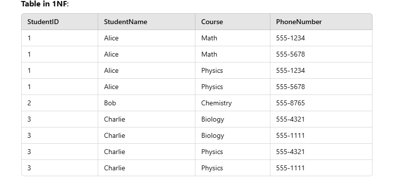

# Query Languages for Data

- Last section of the book we discussed 2 different data modelling strategies document and relational, today the plan is to go over the white paper that was the birth of the relational model, decalarative querying, and the take a quick look into decalrative language implementation inside of a Data Intensive Application

## DDIA Declarative Language Section Summary

- Discusses different ways to interact with our data.

- Imperative: Primitive

- Declarative: The abstraction that just tells it the pattern you want

- Declarative is saying "What you want" and Imperative is saying "How you want it"

- Most document models will expose some imperative way of programming against them, if you've ever done a join by hand for 2 collections of cosmos, or mongodb. If you have used the scan operation on redis and then filtered on your own. However there is a little hybrid model where everyone is writing some QL that provieds some level of declarativeness, but this is in contrast to relational models that use a declarative query language as your only option to interact with them.

- Declarative moved the responsibility of imperative away from caller, and to the callee. Someone has to tell the computer in imperative instructions what to do, it's just not the you as an applicaiton developer anymore.

- While formalizing the relational model EF Codd also formalized relational algebra. Relational algebra builds on and extends set theory with operators specialized for handling relational data, while imposing additional constraints like schemas and structured tuples. It also omits some purely set-theoretic operations that are not applicable to relational data.

- Querying a relational model can be done by using the primitives of realtional algebra. So we basically outsource the logic of the "how" to the database implementers. Following the same ARC as writing assembly to letting compiler write your assembly.

## EF CODD WHITEPAPER (Relational model of Data for Larged Shared Data Banks) 1972!!! Birth of relational model, relational algebra and SQL https://www.seas.upenn.edu/~zives/03f/cis550/codd.pdf
- This is inverse of the mongodb paper that teaches you how to migrate from relational to document model.

- Paper introduces 2 core concepts. Formal definition of a relational model, and relational algebra.

- The original EF Codd paper formalizing a relational model reads like an interface that he suggested a storage layer provides. Cool line in the paper that says on top of this interface of relations that support the operators a declarative language could be built. If you sit behind this abstraction then internally you can choose to change your details each release and not affect the query layer again. Sorta like a standard.

- Relation (Table): A relation is a table with rows and columns. Each relation represents an entity or a relationship.
- Tuple (Row): A tuple is a single row in a relation. It represents a specific instance of the entity or relationship.
- Attribute (Column): An attribute is a column in a relation. It defines a property of the entity or relationship.
- Domain: A domain is the set of permissible values for an attribute. Ensures data integrity by restricting values.
- Key: A key uniquely identifies a tuple in a relation.
- Primary Key: Uniquely identifies rows.
- Foreign Key: References keys in other tables to establish relationships.

### Normalization (Just see the diagrams, if there is time we come back to it)
Normalization organizes data to minimize redundancy and dependency issues:

EF Codd provided rules to get to the normal form from a hierarchial model that was more common, each rule is building on top of the other.
1 NF -> 5 NF (but 4 and 5 are no)

- 1NF: Ensures atomic values (no lists or repeating groups). Each cell may not contain more than 1 value. Each row is unique, aned there are no repeating groups.

- 2NF: Removes partial dependencies. Each column must depend on the whole primary key

- 3NF: Removes transitive dependencies. Primary key must fully define all Non-Key columns and Non-Key columns must not depend on any other key.

---------------

#### Side note on transitive dependencies:

1. StudentID→HODName is a transitive dependency because:
2. StudentID→Department (direct dependency).
3. Department→HODName (direct dependency).
4. BUT HODName depends on StudentID indirectly via Department

- Ensure all attributes depend on the primary key directly and not via another attribute.
- HODName (Head of Department) depends on Department because each department has exactly one HOD, and this relationship is constant within the context of the database schema. In other words, for every department, there is a single, well-defined person who is the Head of the Department (HOD).

---------------

### Why Normalize?

Codd suggested the use of Third Normal Form (3NF) in large shared databases for several reasons related to data integrity, efficiency, and avoiding anomalies. In large-scale databases, especially those with complex relationships and high volume of transactions, ensuring data is normalized up to 3NF can significantly improve the database's performance, maintainability, and consistency. Let's break down the key reasons why Codd advocated for 3NF in the context of large shared databases:

1. Avoiding Redundancy (1970 had more memory constraints thatn we do today):
Redundancy in data leads to data duplication, which can cause storage inefficiencies. When data is not normalized, the same information may be repeated across multiple rows or tables, leading to wasted space and potential inconsistencies.
In 3NF, all non-key attributes are fully dependent on the primary key, and no non-key attribute depends on another non-key attribute (no transitive dependencies). This reduces redundancy by ensuring that each piece of information is stored only once.
Example:
Without normalization, customer details (name, address) could be stored with every order. If a customer has 100 orders, their address is repeated 100 times.
In 3NF, the customer details are stored in a separate table, and only the customer_id is referenced in the orders table. This reduces the need to store the address repeatedly.

2. Maintaining Data Integrity:
Data integrity refers to the accuracy and consistency of data across the database. Without normalization, there are higher chances of anomalies during data operations like insertion, update, and deletion.
Insertion anomaly: A scenario where new data cannot be added unless other related data is also added.
Update anomaly: A scenario where changes to data must be made in multiple places, increasing the risk of inconsistent data.
Deletion anomaly: A scenario where deleting data leads to the unintended loss of related data.
By ensuring the database schema is in 3NF, these anomalies are minimized because each piece of data is stored in one place, making updates and deletions more predictable and consistent.
If a customer changes their address, in a non-normalized database, the address would have to be updated in every order record. In a normalized database (3NF), the address is stored only once in the customer table, and updating it affects only that table.

3. Enabling Efficient Queries:
Large-scale databases often handle complex queries involving joins, aggregations, and searches. If the data is not normalized, queries may become inefficient due to unnecessary duplication of data.
3NF ensures that related data is logically separated into different tables, reducing the size of individual tables and making the queries more efficient by allowing the database to access only the relevant data.
When data is in 3NF, joins between tables are typically faster because the relationships between tables are well-defined, and the data is not duplicated across rows unnecessarily.

4. Supporting Data Consistency and Scalability:
In large shared databases, many users might be accessing and modifying the data concurrently. Without normalization, concurrent updates to the same data might lead to inconsistencies, and enforcing consistency becomes more difficult.
Normalization (particularly 3NF) helps ensure that only the necessary data is updated when changes are made. For example, when a customer's address is updated, only the relevant row in the Customers table needs to be updated, rather than updating multiple rows across multiple tables.
This design makes scaling the database easier, as the database grows in size, and it improves concurrency control because the data is organized in a way that reduces conflicts when multiple operations occur simultaneously.

5. Long-Term Maintainability:
As databases grow and evolve, maintaining them becomes a challenging task. 3NF ensures that the schema is flexible and can adapt to changes over time without causing issues related to data consistency or redundancy.
Future changes (e.g., adding new attributes or modifying relationships between entities) are easier to manage in a normalized schema because the design minimizes unnecessary dependencies between data and clearly defines how tables should relate to one another.
Additionally, 3NF helps to document the relationships and dependencies between entities in a way that is easy for database administrators and developers to understand.

6. Minimizing Redundant Calculations:
When data is not normalized, redundant calculations or stored derived data may have to be repeated in different places (e.g., storing the total amount of an order in each order record).
By adhering to 3NF, such calculations are avoided because related data is stored separately, reducing the need for repeated derived values and making updates and calculations more consistent.

### Operations
The relational model uses relational algebra to define operations for querying and manipulating data:
- Permutation, Projection, Join, Composition, Restriction. Which lead to the following opertors.

- Selection/Permutation (σ): Filters rows based on conditions. SQL Equivalent: SELECT with WHERE clause.
- Projection (π): Selects specific columns. SQL Equivalent: SELECT with column names.
- Join (⨝): Combines rows from multiple relations based on a condition. SQL Equivalent JOIN clause (e.g., INNER JOIN, LEFT JOIN)
- Union (∪): Combines rows from two relations SQL Equivalent: UNION (or UNION ALL if duplicates should be included).
- Difference (−): Subtracts rows of one relation from another. SQL Equivalent: EXCEPT (or NOT EXISTS).
- Intersection (∩): Retrieves common rows between two relations. SQL Equivalent: INTERSECT.

Mathematical Foundation: Based on set theory and preidcate logic, enabling rigorous data operations.
## Quick tour of Languages (Go over quickly - if there is time can show this better)
Preface: I can write a crappy interpreter but I am no language expert, I just know how to write DSL's and use them where I need them.

Providing a declarative language as an interface has similar components to compilers for programming languages! We use the same constructs as compilers to produce a structure from streams of characters. Roughly going from stream -> tokens -> AST -> Optimizer -> IL (sqlite) or another tree -> [backend (this will differ)]

To go from stream to tokens a component called Lexer is written. Write your own or use a generator. "SELECT * FROM foo;" becomes [SELECT, *, FROM, foo, ;]

To go from these tokens to a hierachial structure we need a component called a parser. Write your own or use a generator.

### Side Conversation: How did tokens become these hierarchial structures!?
Based on a set of rules we define all the valid structures the language can represent. CFG's that follow certain rules can be used to either rollout your own parser or use a parser generator. An example of CFG with standardized rules is BNF. Recursive descent parsing is so easy to write once you have this grammar, you have generators you can use.

Without going into the rabbit hole of compilers I can point you to resources that are relevant to this topic:
- Compilers: Principles, techniques, and tools (DRAGON book)
- Codecrafters: writing your own language

## AST to relational algebra
Query planners turn the AST into a walkable relop tree where the nodes instead of representing grammar rules are representing the relational algebra steps now!

The engine now walks the tree in query execution phase and writes the result. Look at code in h2 for this