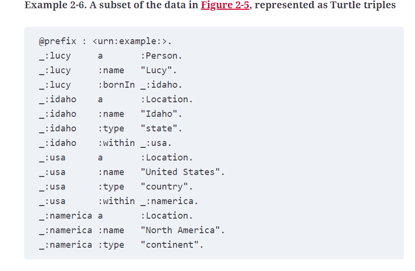

# Graph Like Data Models

- The relational model can handle simple cases of many-to-many relationships, but as the connections within your data become more complex, it becomes more natural to start modeling your data as a graph.

- Graphs consist of two kinds of objects: vertices (also known as nodes or entities) and edges (also known as relationships or arcs). Existing graph algorithms can then operate on the graph.

- graphs are not limited to such homogeneous data: an equally powerful use of graphs is to provide a consistent way of storing completely different types of objects in a single datastore (done by Facebook)

## Property Graph Model

- Expressed as 2 relational tables, one for Vertices, one for edges.
- Vertix composed of an ID, outgoing edges, incoming edges, properties for the vertex (key val pairs)
- Edge composed of an ID, tail vertex (start of edge vertex), head vertex (end of edge vertex), label (decribes relationship), porperties (key val pairs)
- any vertex can have an edge to any other vertex. This
- Using indexing on tail and head edges we can efficiently find incoming and outgoing edges froma vertes, which enables us to traverse a graph faster.
- By using lables for relationshups and properties we can store a lot of different kinds of information in a single graph while still maintaining a clean data model

- Examples of Query Languages -> CQL, SQL using WITH_RECURSIVE, SPARQL (found it unncessary to go deeper into language syntax)

## Triple Store Graph Model
- In a triple-store, all information is stored in the form of very simple three-part statements: (subject, predicate, object). For example, in the triple (Jim, likes, bananas), Jim is the subject, likes is the predicate (verb), and bananas is the object.

