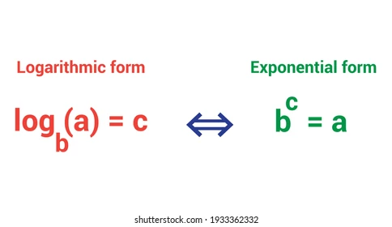
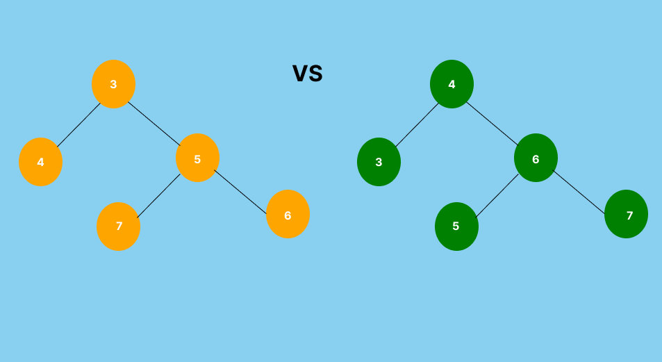
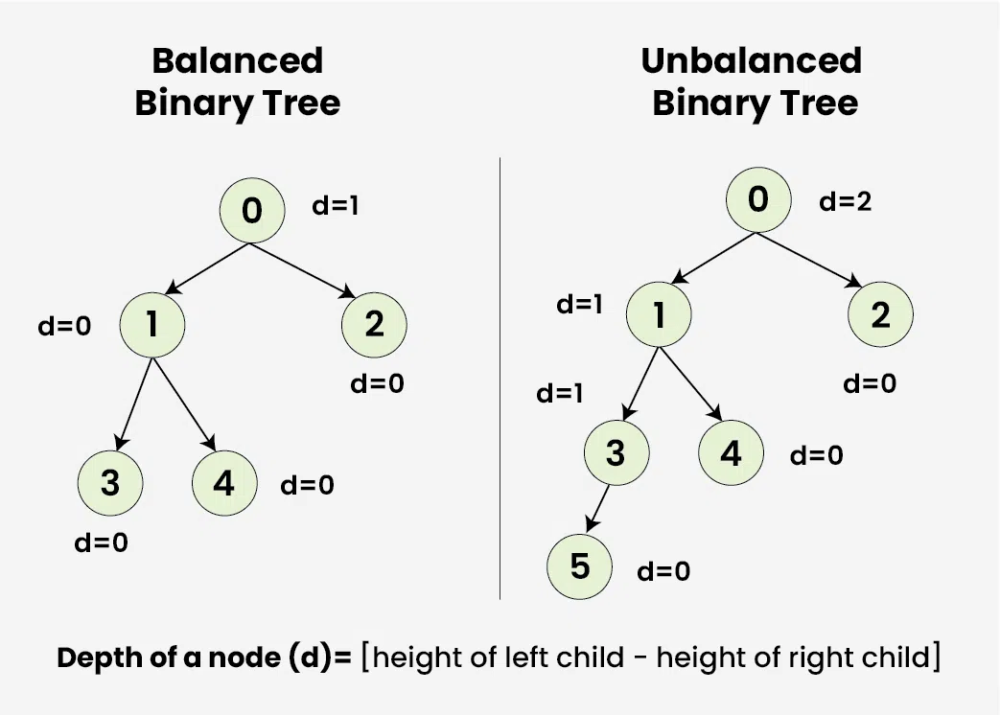
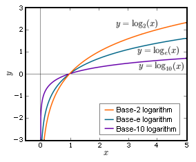
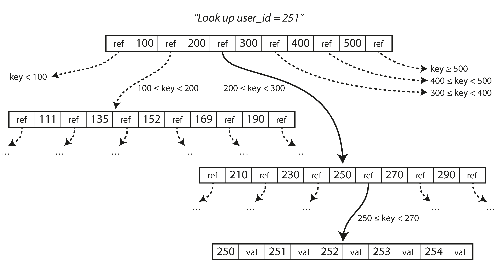

# BTrees!

- Hash Index based storage like riak's bitcask has it's drawbacks:
    - all keys needs to fit in-memory.
    - Range queries suck!

We need alternatives

## BTrees and (+)

- Motivation: we want a data structure that provides fast lookups, while still letting us store more data than what fits in-memory.

- Quick reminder: Understanding trees and logarithms go hand in hand. Here is the logarithm definition for a quick refresher.


### Intuition
- Binary Tree (unsorted) vs Binary Search Tree (in-order traversal shows the nodes are sorted)


- Balanced Trees (because based on the order of insertion we can accidentally create a linked list, and finding the item becomes O(N) worst case time complexity)
    - Defn: in a balanced tree, the height of the left and right subtrees of any node differ by no more than one. This means the tree will need to pay the cost of managing itself to be balanced on insertions and updates, but guarantee us logarithmic time complexity O(log Base 2 (n)) [base 2 because each node has two children and we are dividing the search space by half each step].


- Balanced N-ary Tree: Everything above but except of each node having at most 2 children each node can have atmost N children. Since it is balanced it can still support logarithmic lookup. The bigger the N the slower the logarithm grows. Don't take my word for it here look at a graph!


### Finally the BTree


Btrees are built on the idea that we can traverse a balanced N-ary tree like data structure where the nodes of the N-ary are on-disk, we can traverse the tree reading each page/node into the memory and deciding which node to move to next till we get to our record of interest. This N-ary tree will maintain some sort of ordering that let's us find items in log(n) time complexity. So maybe our reads are not as fast as the hash index but we can store way more data since we are writing and reading everything from disk!
The pages are fixed in size and "block" aligned to optimize interaction between memory and disk since disk hardware also stores fata in fixed-sized blocks. The common block size for pages in BTree-based storage engines ranges from 512 bytes to 65536 bytes1. This range allows for a balance between storage efficiency and performance optimization.

Point lookups are now logarithmic but range scans on key-value pairs involve alot of random IO walking the tree. To support range queries by key we just need to add the ability to walk from leaf node to leaf node.

- balanced and sorted N-ary tree == BTree
- balanced and sorted N-ary tree where all the leaf nodes are linked to each other == B+ Tree


[RavenDb which we use as reference is linked here](https://github.com/ravendb/ravendb/blob/v7.0/src/Voron/Data/BTrees/Tree.cs)

### B+Tree data structure pseudo-code
- minKeys = (maxKeys - 1) // 2
- A B-Tree of order t has:
    * Minimum keys in a non-root node = t - 1  (Use this to merge)
    * Maximum keys in a node = 2t - 1 (Use this to split)
    * Minimum children = t 
    * Maximum children = 2t (we use this to split)
```
class BTreeNode:
    keys[]     // Array of keys in the node
    children[] // Array of child pointers (null if leaf)
    leaf       // True if this is a leaf node
    n          // Current number of keys
```

For a concrete implementation take a look at RavenDb's  `TreePage.cs` `TreePageHeader.cs` classes
A page is an array of bytes in the following format:
[TreePageHeader][]


#### Search (RavenDB `Tree.cs`  Method `SearchForPage`)
1. Recursively search for the key.
2. If the key is in the current node, return it.
3. If not, go to the correct subtree.

#### Insert (RavenDB  `Tree.cs` Method `DirectAdd ` returns a pointer where value is copied into)
1. If the root is full:
    - Create a new root.
    - Split the old root (Split Operation: Split a full child node into two. Promote the middle key to the parent.)
    - Insert the key into the appropriate subtree.
2. Otherwise:
    Recursively insert the key into the correct child.

#### Delete (RavenDB `Tree.cs` Method  `Delete`)
1. Find the key.
2. If it's in a leaf, delete it directly.
3. If it's in an internal node:
    * If the left child has enough keys, promote the predecessor.
    * If the right child has enough keys, promote the successor.
    * If both children are too small, merge them and delete the key.


#### BTree Challenges and Complications
- B-tree write operation involves overwriting a page on disk without changing its location.

- This differs from log-structured indexes like LSM-trees and our Bitcask, which only append to files.

- Overwriting on magnetic hard drives involves moving the disk head and overwriting the sector. On SSDs, the process is more complex due to the need to erase and rewrite large blocks. Some operations require multiple pages to be overwritten, which can be risky if the database crashes.
B-tree implementations often include a write-ahead log (WAL) to ensure resilience to crashes.

- Concurrency control is required when multiple threads access the B-tree, typically managed with latches.
Log-structured approaches are simpler in terms of concurrency control as they perform merging in the background, and are immutable. Can't produce race conditions when the data is immutable!.

### A teaser for faster writes!

**oh no but didn't we say the fastest interaction with disk is sequential IO and not random IO? but our writes are always doing random IO! How do we tackle this?**