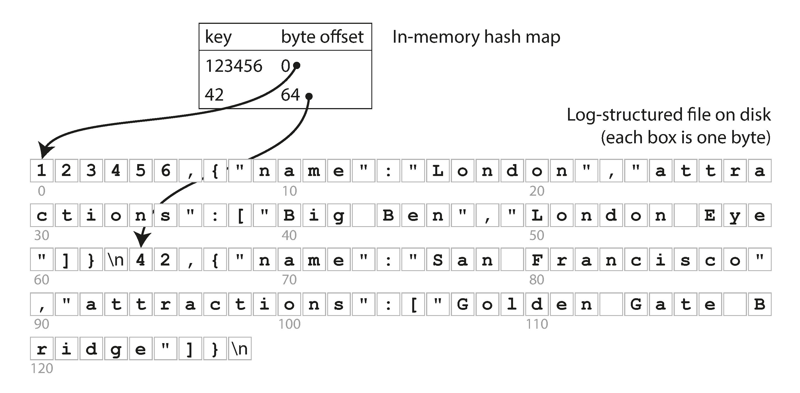
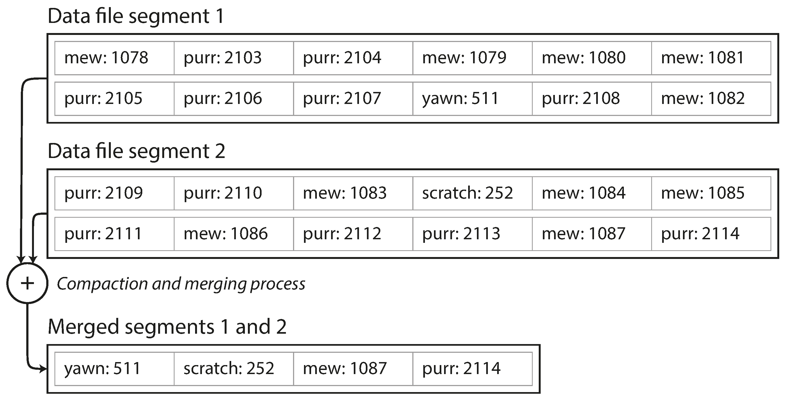

# Data Structures That Power Your Database

- Fundamental level ->  how we can store the data that we’re given, and how we can find it again when we’re asked for it.

- Why should you, as an application developer, care how the database handles storage and retrieval internally? You’re probably not going to implement your own storage engine from scratch, but you do need to select a storage engine that is appropriate for your application, from the many that are available. In order to tune a storage engine to perform well on your kind of workload, you need to have a rough idea of what the storage engine is doing under the hood.

- Different ways to write a storage engine for different workloads. Are you in a write heavy scenario, read heavy scenario,update heavy, blind insert heavy, complex querying needs, how much data, how quickly...etc you get the point

- 2 families of storage engines for Transactional Database: Log-structured engines, and page-oriented storage engines.

## Terms:
- Index: Data structure used to efficientyly find a value in a database. index is usually an additional structure ontop of the primary.
- Logs: an append-only sequence of records. It doesn’t have to be human-readable; it might be binary and intended only for other programs to read 

-------------

- Maintaining additional structures incurs overhead, especially on writes. For writes, it’s hard to beat the performance of simply appending to a file, because that’s the simplest possible write operation. Any kind of index usually slows down writes, because the index also needs to be updated every time data is written

- important trade-off in storage systems: well-chosen indexes speed up read queries, but every index slows down writes. For this reason, databases don’t usually index everything by default, but require you—the application developer or database administrator—to choose indexes manually, using your knowledge of the application’s typical query patterns

-----------

### Why Sequential I/O is Good for Disks
1. **Mechanical Hard Drives (HDDs)**:
   - **Sequential I/O**: Data is read or written in a contiguous manner, minimizing the need for the disk's read/write head to move.
     - Result: Faster performance due to reduced seek times and rotational delays.
   - **Random I/O**: The disk head must move frequently to access non-contiguous sectors, significantly increasing latency.

2. **Solid-State Drives (SSDs)**:
   - While SSDs don't have moving parts, they still perform better with sequential I/O due to optimizations in internal controllers and reduced overhead in managing multiple I/O requests.

3. **Caching and Throughput**:
   - Sequential I/O allows systems to use caching and prefetching effectively, increasing read/write efficiency.

---

### Performance Difference
1. **HDDs**:
   - Sequential reads/writes: **100–200 MB/s** (or higher with modern drives).
   - Random reads/writes: Often **1–2 orders of magnitude slower** (e.g., **0.1–2 MB/s**) due to frequent seek times (~5–10 ms per seek).

2. **SSDs**:
   - Sequential reads/writes: **500–7000 MB/s** (depending on the drive, e.g., SATA vs. NVMe).
   - Random reads/writes: Better than HDDs but still slower than sequential, often **50–500 MB/s** for small random I/O.

3. **Relative Impact**:
   - **HDDs**: Sequential I/O can be **10–100 times faster** than random I/O.
   - **SSDs**: Sequential I/O is **2–10 times faster**, depending on the workload and queue depth.

---

### Why This Matters
- Systems like **Bitcask** and databases optimized for disk performance (e.g., LSM-tree-based systems) leverage **sequential I/O** to maximize throughput and minimize latency.
- Sequential I/O reduces wear and overhead, which is especially critical for performance-critical applications and large datasets.

--------------

## Hash Indexes (BITCASK)
```
Dictionary<string (key), Tuple<string (filename), usize (byte_offset)>>
```

- Used as underlying storage engine by RIAK: https://docs.riak.com/

## HLD:
- Hashtable that maps key to metadata where metadata holds filename and offset to actual value store on disk


- Bitcask offers high-performance reads and writes, subject to the requirement that all the keys fit in the available RAM, since the hash map is kept completely in memory. The values can use more space than there is available memory, since they can be loaded from disk with just one disk seek. If that part of the data file is already in the filesystem cache, a read doesn’t require any disk I/O at all.

### When is this good to use?
- A storage engine like Bitcask is well suited to situations where the value for each key is updated frequently, as well as writes in general.

### Drawbacks:
- The hash table must fit in memory, so if you have a very large number of keys, you’re out of luck. In principle, you could maintain a hash map on disk, but unfortunately it is difficult to make an on-disk hash map perform well. It requires a lot of random access I/O, it is expensive to grow when it becomes full, and hash collisions require fiddly logic [5].

- Range queries are not efficient. For example, you cannot easily scan over all keys between kitty00000 and kitty99999—you’d have to look up each key individually in the hash maps. Depending on the internal implementation of the indexing data structure this is solvable :)

## White paper discussion points: https://docslib.org/doc/5732806/bitcask-a-log-structured-hash-table-for-fast-key-value-data

- Goals: 1st page whitepaper

- Write path: in code

- Read path: in code

- Update path: in code

- Remove path: algorithm in code

- Merging: algorithm in code. Needed for space recalamation, otherwise the log will grow forever.


- Concurrency (Single writer, multi reader, heavily dependen on mutexes and locking of files): Ability to handle multiple clients simulatneously.

- Crash consistency: refers to the ability of a system to recover to a valid state after a crash or unexpected shutdown. Bitcask provieds this by 2 phase updates and checksumming

### Two-Phase update:
- Writes happen in 2 phases, first to file, and then to keydir, the sequence of these two operations inherently brings with it some level of crash consistency.

- If we write to file but dont write to in-memory keydir then the write on the file is just ignored so partial failures can be tolerated.

----------

### Checksumming
- During Write Operations:
    When a new key-value pair is written to the log file, Bitcask computes a checksum over the data to be written.
    The checksum is typically computed using a cryptographic or hash function (e.g., CRC32, SHA256).
    This checksum is appended to the log file along with the key-value pair.
    So, each record in the log file consists of:

    Key and Value: The actual data being stored.
    Checksum: A hash or checksum of the data (e.g., key and value).

- During Read Operations:
    When a key-value pair is read from the log file, Bitcask reads both the data and the associated checksum.
    It then recomputes the checksum for the data and compares it to the one stored in the log file.
    If the checksums match, the data is considered valid and is returned to the user.
    If the checksums do not match (indicating possible corruption), the system will either discard the data or raise an error, depending on how the application is configured to handle such scenarios.
---
- Recovery (build from data file aka append only file, where we can iterate and build keydir)
